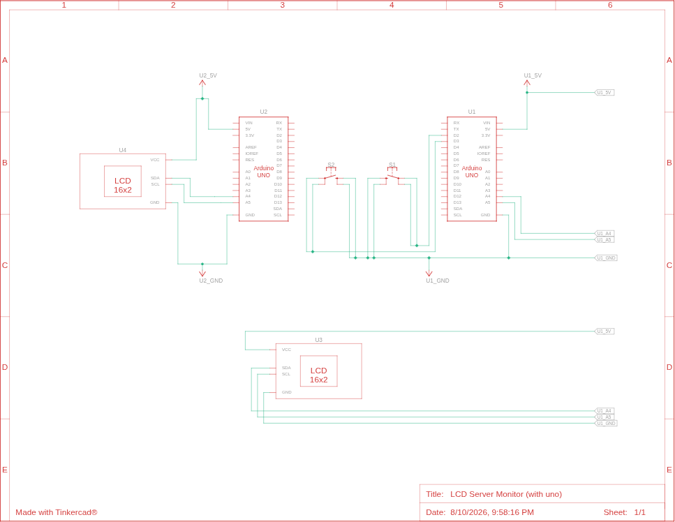

# 📟 LCD Server Monitor

> Arduino-based display system showing real-time server metrics (CPU, RAM, disks) and currently playing music on a 16x2 LCD screen.


## 📦 Hardware

- Arduino Mega 2560 (or Uno)
- 16x2 LCD with I2C backpack
- 2 push buttons (mode navigation)
- 10kΩ resistors (optional, internal pull-up used)
- PC / server running Python scripts




## 🔧 Features

- **Mode 0** : CPU usage, temperature, RAM usage
- **Modes 1 to N** : disk usage per mount point (used/total/percentage)
- **Last mode** : system info (IP, hostname, kernel, uptime)
- **Navigation** : physical buttons to switch between modes
- **Music display** : scrolls title and artist with pause/resume


## 🐍 Python side (data sender)

- Collects system metrics with `psutil`
- Sends data over serial to Arduino
- Format : `DATA:temp|cpu|ram_used|ram_total|ip|hostname|kernel|distro|uptime|disk1_used|disk1_total|disk1_percent|disk1_path|...`
- Fetches current music metadata using `playerctl`


## 🔌 Installation

1. **Arduino** : upload the `.ino` sketch using `arduino-cli`
2. **PC** : install Python dependencies
   ```bash
   pip install psutil pyserial unidecode requests flask
   sudo pacman -S playerctl  # on Arch/Garuda
   ```
3. Run the sender script
   ```bash
   python data.py
   ```
